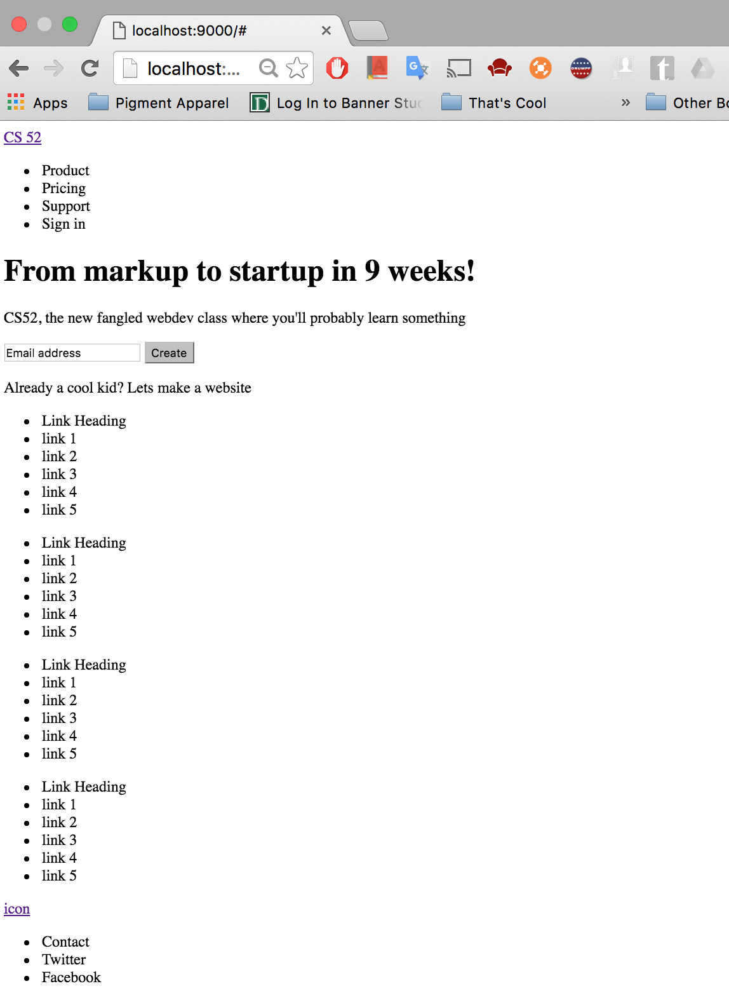
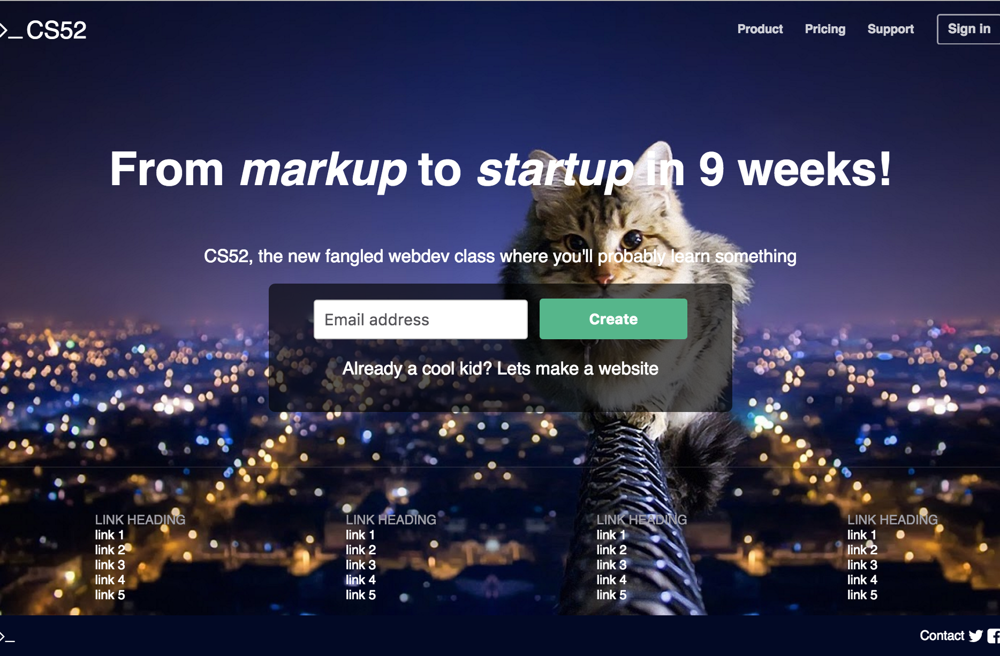
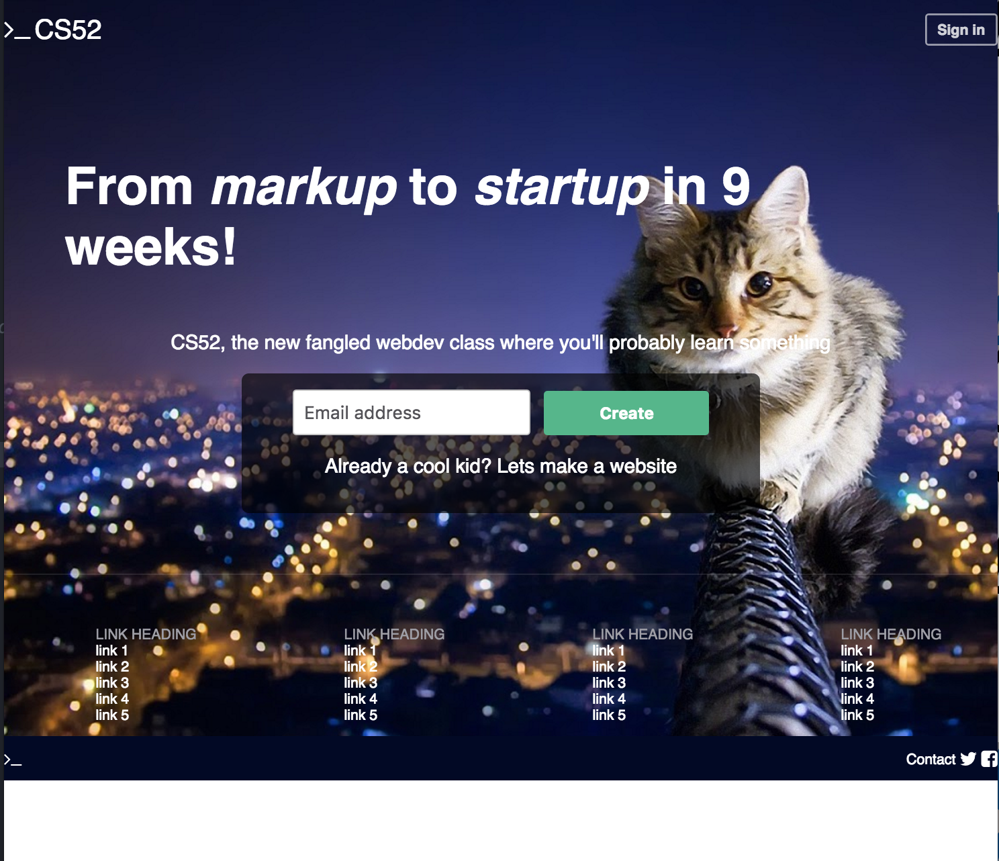
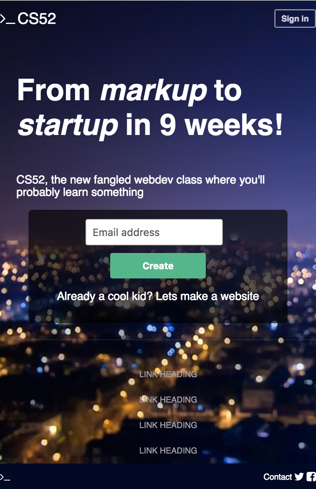

# README for Landing Page
This is a reconstruction of the slack.com landing page, utilizing only HTML and CSS to create the desired look. All links simply point back to the page. Using flex boxes worked well, however I was unable to get the middle text to be centered when the page shrinks and it is on multiple lines, and I had a problem with a white bar at the bottom of the page if the window is larger than the information takes up (pictured in image 3). I was also unable to make the gradient work.

Layout Stage:

Full Screen Finished:

Full Screen demonstrating white bar issue:

Smaller screen/mobile:

